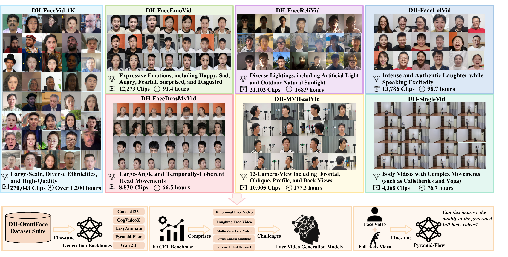
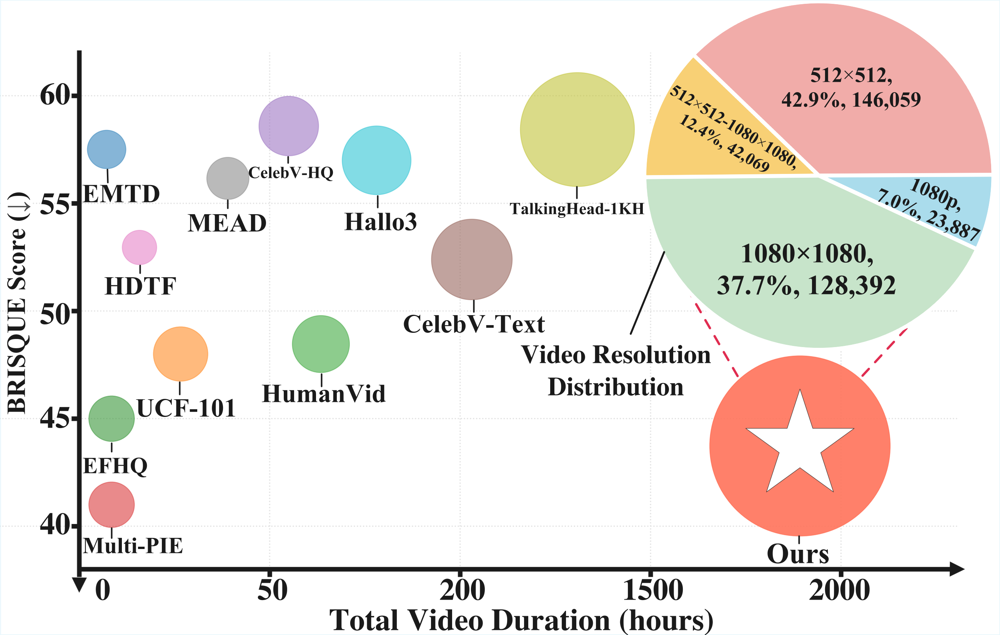
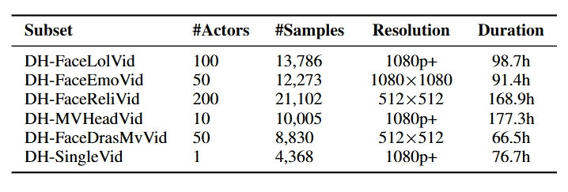

<div align="center">


# DH-OmniFace: A Large-Scale and Multi-Attribute Dataset Suite for Controllable Face Video Generation

<span style="font-size: 24px; font-weight: bold;">🏆 Arxiv 2025 🏆</span>

[](#)
[](https://fenghe12.github.io/DH-OmniFace/)
[](https://docs.google.com/forms/d/e/1FAIpQLSeSMkATTXO22YvLFj-qC_hDM8LCd912Y45cdyINU91HbgP9KQ/viewform?usp=header)

</div>

Official repository of **DH-OmniFace: A Large-Scale and Multi-Attribute Dataset Suite for Controllable Face Video Generation**.

*[He Feng](https://github.com/fenghe12), [Donglin Di](https://scholar.google.com/citations?hl=zh-CN&user=L8tcNioAAAAJ), [Tonghua Su](https://scholar.google.hk/citations?hl=zh-CN&user=67fxVzoAAAAJ), [Yin Chen](#), [Xiu Su](#), [Hongyan Xu](#), [Zhongjie Wang](#), [Xiangqian Wu](#), [Song Yang](#), and [Lei Fan](https://hellodfan.github.io/)*

---

## 📖 Dataset Overview



Overview of the proposed DH-OmniFace. The suite includes seven components: DH-FaceVid-1K for talking face generation, DH-SingleVid for
complex body movements, DH-FaceReliVid for diverse lighting conditions, DH-MVHeadVid for multi-view head poses, DH-FaceEmoVid for expressive
emotions, DH-FaceLolVid for authentic laughter, and DH-FaceDrasMvVid for large-angle head movements. The lower panels summarize our experiments:
i) fine-tuning generative backbones, ii) proposing the FACET benchmark, and iii) exploring joint training of face and full-body data to enhance quality and diversity in full-body video generation.

---

## 📥 Download


**Scale:** 340k samples / 1.8k hrs duration / ~5 TB

If you wish to download the DH-OmniFace dataset, please follow these steps:

1.  **Fill out the request form**: To prevent misuse of the dataset, we require you to submit information for review and approval. Please carefully fill out [**this form**](https://docs.google.com/forms/d/e/1FAIpQLSeSMkATTXO22YvLFj-qC_hDM8LCd912Y45cdyINU91HbgP9KQ/viewform?usp=header). **You must use an official institutional email address and clearly state your research purpose.** Requests from personal email providers (e.g., Gmail, Outlook) will be rejected. When filling out the form, ensure your information is accurate, especially **your email address**, as this is where we will send the download instructions.

2.  **Await email delivery**: Once we receive and approve your submission, we will send you an email with download instructions, typically **within 2-3 working days**. Please keep an eye on your inbox, including the spam or junk mail folders, to avoid missing our message. We currently support the four download methods specified in the request form. For optimal performance, we recommend using either Aliyun Drive or Hugging Face.

3.  **Download the dataset**: After receiving the email, you can click the download link provided and follow the instructions on the page to complete the download process. If you encounter any issues or do not receive the email within a reasonable time, please contact us at **fenghe021209@gmail.com**.

**Note:** These video samples are sourced from crowd-sourcing platforms. To ensure the proper use of the data and prevent misuse, we manually review all download requests. By downloading and using this dataset, you are required to comply with [**the license agreement**](https://github.com/fenghe12/DH-OmniFace/blob/main/LICENSE). Thank you for your understanding and cooperation.

---

## 🚀 Open-source Plan

Our open-source roadmap is as follows. We will update the status here as we make progress.

- 🔄 Phase 1: Open all dataset videos and annotations (On-going)


---

## 🎬 Video Samples

<table class="center" style="border-collapse: collapse; margin: auto;">
  <!-- Row 1: Numeric IDs -->
  <tr>
    <td width="20%" style="border: none; padding: 5px;"></td>
    <td width="20%" style="border: none; padding: 5px;"></td>
    <td width="20%" style="border: none; padding: 5px;"></td>
    <td width="20%" style="border: none; padding: 5px;"></td>
    <td width="20%" style="border: none; padding: 5px;"></td>
    <td width="20%" style="border: none; padding: 5px;"></td>
  </tr>

  <!-- Row 2: Alphanumeric IDs -->
  <tr>
    <td width="20%" style="border: none; padding: 5px;"></td>
    <td width="20%" style="border: none; padding: 5px;"></td>
    <td width="20%" style="border: none; padding: 5px;"></td>
    <td width="20%" style="border: none; padding: 5px;"></td>
    <td width="20%" style="border: none; padding: 5px;"></td>
    <td width="20%" style="border: none; padding: 5px;"></td>
  </tr>
</table>
---

## 📊 Datasets Comparison

Compared with other datasets, DH-OmniFace has a larger data volume, superior visual quality, and broader attribute coverage.

|  |  |


---

## 📈 Statistics

Details of each subset.


---

## ⚙️ Collection Pipeline


Overview of the data curation pipeline, comprising four main stages: raw data acquisition, video preprocessing, noisy data filtering, and annotation
generation using Qwen2.5-VL and Llama 3, followed by two-stage manual verification.


---

## 🧠 Trained Models

**[Coming Soon]**

---

## ✒️ Citation

**[Coming Soon]**
<!-- If you find the DH-OmniFace dataset useful for your work, please consider citing our paper:
```
@inproceedings{di2025facevid,
      title = {DH-FaceVid-1K: A Large-Scale High-Quality Dataset for Face Video Generation},
      author = {Di, Donglin and Feng, He and Sun, Wenzhang and Ma, Yongjia and Li, Hao and Chen, Wei and Fan, Lei and Su, Tonghua and Yang, Xun},
      booktitle = {Proceedings of the IEEE/CVF International Conference on Computer Vision (ICCV)},
      year = {2025}
}
``` -->
